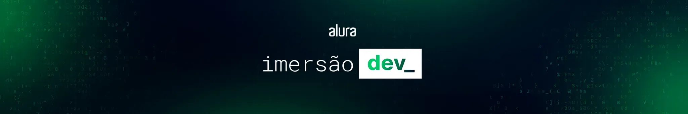
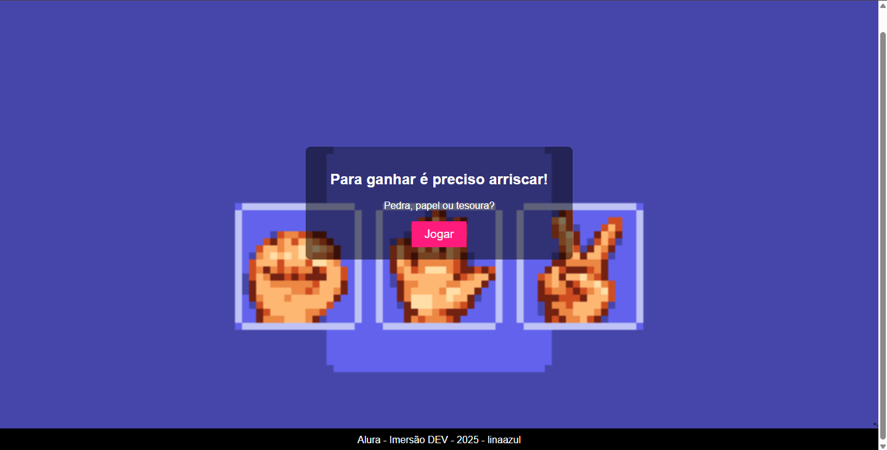
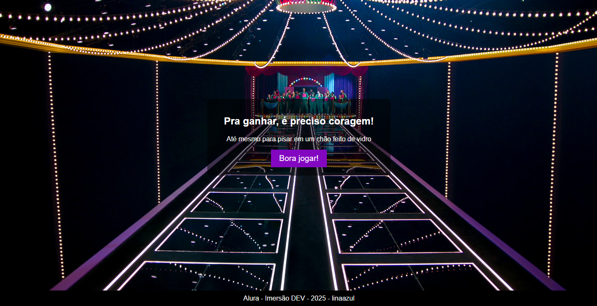

# 🎮 Imersão Dev 9ª Edição - Alura



Repositório com os projetos desenvolvidos durante a **Imersão Dev 9ª Edição** da Alura. Aqui você encontrará jogos e aplicações práticas para aprender lógica de programação, JavaScript, HTML e CSS.

## 🛠️ Tecnologias


## 🎯 Projetos
### 1️⃣ Conversor de Wons para Reais (Aula 01)

- **Funcionalidade**: Converte valores da moeda Won Coreano para Real Brasileiro.
- **Destaque**: Cálculo em tempo real com taxa fixa.

### 2️⃣ Jogo de Pedra, papel e tesoura (Aula 02)

- **Funcionalidade**: Jogue uma partida de jokenpô contra um robô, para ganhar é preciso arriscar!
- **Destaque**: Lógica simples, não permite erros de input.

### 3️⃣ Jogo de salto no vidro do squid game (Aula 03)

- **Funcionalidade**: Jogue uma partida de salto no vidro! Teste sua sorte pulando em 3 vidros e veja se é capaz de chegar no fim.
- **Destaque**: Lógica simples, não permite erros de input, tem loop while.

## 🖥️ Como Executar Localmente
Siga estes passos para testar o conversor:
```bash
# 1. Clone o repositório
git clone https://github.com/linaazul/imersao-dev.git

# 2. Acesse a pasta do projeto
cd imersaodev2025/aula0X/index.html

# 3. Abra o arquivo index.html no navegador
# (Dê duplo clique ou use a extensão "Live Server" do VS Code)
```

## 📌 Próximos Passos
- Adicionar mais projetos conforme as aulas avançam


