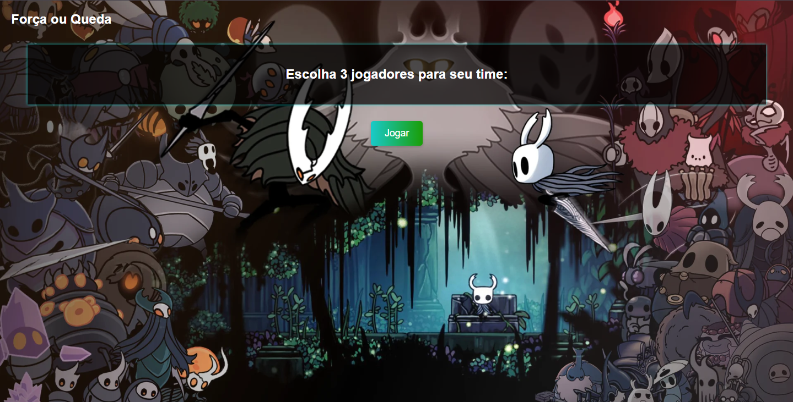
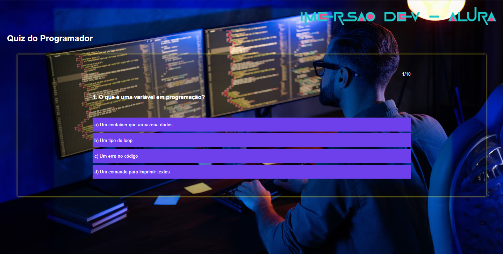

# 🎮 Imersão Dev 9ª Edição - Alura


Repositório com os projetos desenvolvidos durante a **Imersão Dev 9ª Edição** da Alura. Aqui você encontrará jogos e aplicações práticas para aprender lógica de programação, JavaScript, HTML e CSS.

## 🛠️ Tecnologias


## 🎯 Projetos
### 1️⃣ Conversor de Wons para Reais (Aula 01)

- **Funcionalidade**: Converte valores da moeda Won Coreano para Real Brasileiro.
- **Destaque**: Cálculo em tempo real com taxa fixa.

### 2️⃣ Jogo de Pedra, papel e tesoura (Aula 02)

- **Funcionalidade**: Jogue uma partida de jokenpô contra um robô, para ganhar é preciso arriscar!
- **Destaque**: Lógica simples, não permite erros de input.

### 3️⃣ Jogo de salto no vidro do squid game (Aula 03)

- **Funcionalidade**: Jogue uma partida de salto no vidro! Teste sua sorte pulando em 3 vidros e veja se é capaz de chegar no fim.
- **Destaque**: Lógica simples, não permite erros de input, tem loop while.

### 4️⃣ Cabo de guerra contra os chefões do Hollow Knight (Aula 04)

- **Funcionalidade**: Jogue uma partida de cabo de guerra contra os bosses mais desafiadores do Hollow Knight. Será que você vai conseguir derrotar a radiância com seus 2 aliados?
- **Destaque**: Lógica simples com for, condições e arrays. Adiciona e remove itens usando funções de Arrays.

### 5️⃣ Quiz de Programação para iniciantes (Aula 05)

- **Funcionalidade**: Um quiz de programação de nível iniciante. Descubra novos conceitos ou teste seu conhecimento básico.
- **Destaque**: Estrutura clara: perguntas e respostas organizadas em array de objetos, lógica principal: uso de for para percorrer perguntas e if para verificar respostas, interatividade: botões clicaveis.

## 👩‍💻 Execute você mesmo!

| Aula   | Link de Acesso                     |
|--------|------------------------------------|
| **01** | <a href="https://conversor-de-moedas-ten-smoky.vercel.app/" target="_blank" rel="noopener noreferrer">🔗 Aula 01</a> |
| **02** | <a href="https://pedra-papel-tesoura-blond-one.vercel.app/" target="_blank" rel="noopener noreferrer">🔗 Aula 02</a> |
| **03** | <a href="https://pule-no-vidro.vercel.app/" target="_blank" rel="noopener noreferrer">🔗 Aula 03</a> |
| **04** | <a href="https://imersao-dev2025-fhwh.vercel.app/" target="_blank" rel="noopener noreferrer">🔗 Aula 04</a> |
| **05** | <a href="https://imersao-dev2025.vercel.app/" target="_blank" rel="noopener noreferrer">🔗 Aula 05</a> |

✨ **Dica:** Clique nos links acima para testar cada projeto online!

## 🖥️ Como Executar Localmente
Siga estes passos para testar o conversor:
```bash
# 1. Clone o repositório
git clone https://github.com/linaazul/imersao-dev.git

# 2. Acesse a pasta do projeto
cd imersaodev2025/aula0X/index.html

# 3. Abra o arquivo index.html no navegador
# (Dê duplo clique ou use a extensão "Live Server" do VS Code)
```

## 📌 Próximos Passos
- Aprimorar os códigos conforme erros são notados


